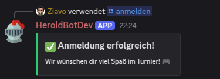

# Verbesserungen

## Game Poll rework

### Option 1
- Bot zeigt 5 beliebte/zufällige Spiele an
- Manuell spiele nachrücken lassen

### Option 2
- 1. Wird die Kategorie gewählt (Shooter, Strategie etc)
- 2. Abstimmung des eigentlichen Spiels

### Option 3
- Maximal 5 Spiel pro Seite
- Seiten blättern („🔼 Vorherige | 🔽 Nächste“)

---
 
## Fixes

### Logger in Berechtigungschecks
- Vor allem bei den Admin befehlenen (wer, wann, welcher Befehl)

### Evtl alle Permissions, Channelchecks in Funktionen
- Zentraler Platz für Änderungen
    - Unterschiedliche Funktionen für unterschiedliche Channel/Permissions?

### Wenn Spiele gleich auf sind
- Stechen (neue abstimmung)
- Evtl nur eine Stimme

### Time
- Poll Zeit scheint von der Anmeldungszeit abgezogen zu werden
 (Poll 2 Tage, Anmeldung 7 Tage dann Anmeldunge effektive 5 Tage) <- Sollte so nicht sein

### Anmeldelogik
 - Bei Anmeldung mit Samstag und Sonntag wir kein "Anmeldung Erfolgreich ausgegeben"
  als beispiel wie es aussehen sollte

### Spielplan übersicht 
- Spielplan 

### Machtmaker/Slots

- Uhrzeit des Matches passt nicht zur Verfügbarkeit der Spieler
 
https://todo.0x09.de/?controller=BoardViewController&action=show&project_id=9&search=status%3Aopen
